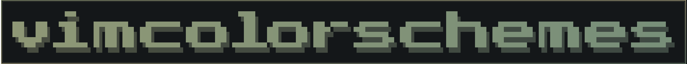
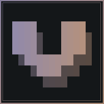
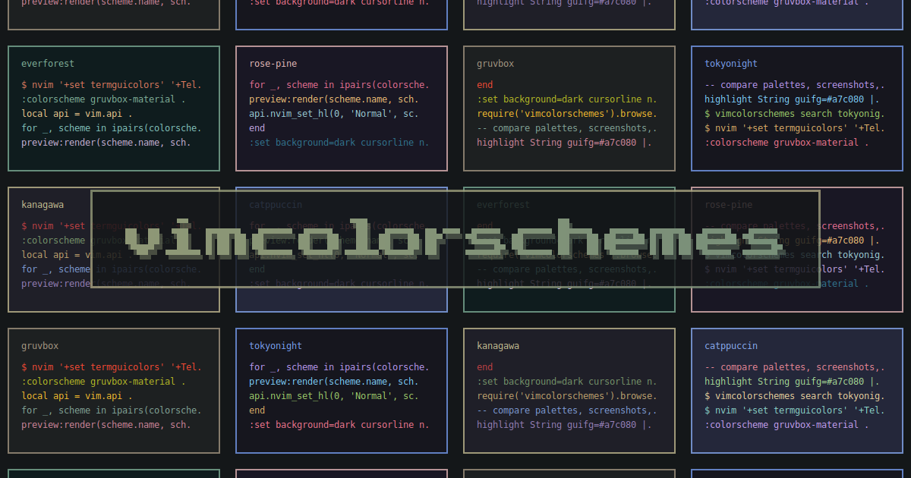

# vimcolorschemes assets

Generated visual assets for vimcolorschemes.

## Preview







## Generate

Requires Go 1.25 or newer.

```sh
make generate
```

Files are generated in `./out`.

## Test

```sh
make test
```

Generated SVG and PNG files are written to per-asset directories under `out/`, including dark/default, `*-light`, and `*-transparent` variants. Non-transparent variants also include WebP files. Each background variant has a bordered and `*-borderless` form. Open Graph images are generated as fixed 1200x630 dark social cards under `out/opengraph/`.

## Theme

Edit `theme.toml` to change the generated images without changing Go code. It controls the font, dark and light backgrounds, gradient colors, text spacing, shadow, and per-asset padding/offsets.
