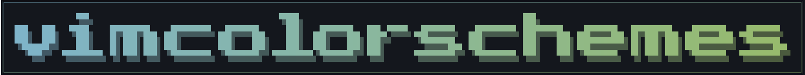

# vimcolorschemes assets

Generated visual assets for vimcolorschemes.

## Preview




## Generate

Requires Go 1.25 or newer.

```sh
make generate
```

Generate a single asset:

```sh
make generate-v
make generate-vimcolorschemes
```

## Test

```sh
make test
```

Generated SVGs are written to `out/`.
